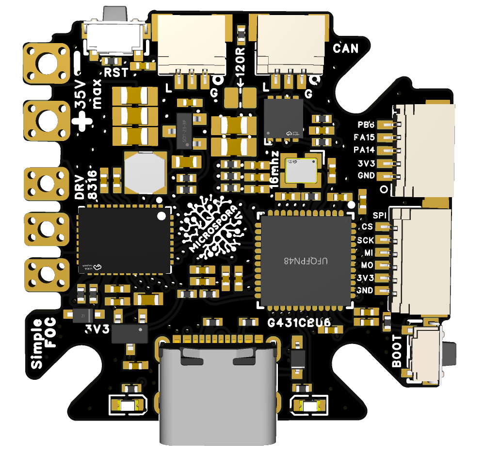
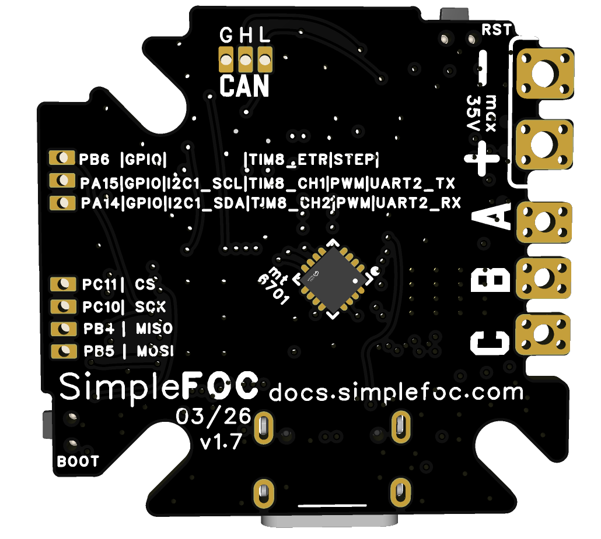
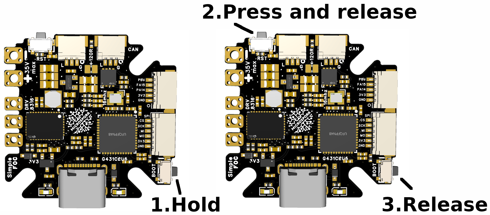

Microspora board firmware based on SimpleFOC using platformIO
========================================



A template platformIO project for the microspora firmware using SimpleFOC.

> microspora has been originally developed by [@Rambros](https://github.com/rambros3d) - See [Github](https://github.com/rambros3d/MicroSpora-SimpleFOC) 


This is the firmware for the microspora board, a compact motor driver board based on the DRV8316 IC and an STM32G4 series microcontroller, and MT6701 encoder. The board is designed for BLDC motors under 10Amps, and is compatible with the SimpleFOC library. It is super compact and it seems to be a very very nice fit to start with SimpleFOC!


## Requirements

You'll need to have [PlatformIO](https://platformio.org/) and download the code from this repository. 

```bash
git clone git@github.com:simplefoc/microspora_simplefoc_firmware.git
```

## Code features
- Ful SimpleFOC firmware
    - Real-time control loop using hardware timer interrupts (10kHz)
    - Driver and sensor fully configured for the microspora board
      - DRV8316 config
         - 6PWM
         - High slew rate (200V/us)
         - 5V buck output
         - 300mV/A current sensing gain
      - MT6701 config
         - 10MHz SPI communication
         - Setup for eccentricity compensation (optional - commented by default)
    - Motor characterization and current controller tuning functions
    - Use communication 
        - Commander interface configured for webcontoller: https://webcontroller.simplefoc.com/
        - CAN communication using SimpleFOC CAN protocol (optional - it does nothing if no CAN messages are sent/received)
            - Example Python scripts for testing CAN communication with the microspora using the SimpleFOC CAN protocol


## Board features
- Compact design 33mm x 32mm
- Fully SimpleFOC compatible firmware
    - allows for BLDCs and Steppers (hybrid stepper mode)
- DRV8316 motor driver IC
    - 8A peak current
    - Integrated buck converter for 5V output
    - Integrated current sensing (configurable gain)
- STM32G4 series microcontroller (STM32G431CBU6)
- MT6701 magnetic encoder 
    - 14-bit resolution
    - 10MHz SPI communication
- CAN communication 
    - Daisy chainable JST SH connectors for CAN bus
- USBC connector
    - Serial commnunication
    - DFU firmware programming
- On-board LED for status indication
- Additional connectors
    - 6pin JST - SPI communication (SPI3 the same as DRV)
    - 5pin JST 
        - I2C communication (SCL/SDA)  or
          - can be used for STEMMA or QWIIC
        - UART communication (TX/RX) or
        - Encoder interface (A/B/I) or
        - PWM input/output  or
        - Step/dir input or
        - 3 GPIOs 
    


## Programming and usage



To program the board you will need to put it in DFU mode by pressing the BOOT while powering it on. The simplest way is to connect the board to your computer using the USBC connector, and then :
1. press and hold the BOOT button 
2. pressing the RESET button, 
4. then release the RESET button while still holding the BOOT button 
5. After a second or two release the BOOT button.

The board should now be in DFU mode and you can upload the firmware using platformIO. 
The same procedure can be used if the board is powered by an external power supply, but you will need to connect the board to your computer using the USBC connector for the programming.

## Pinout 

### 5pin JST connector (I2C/UART/Encoder/PWM/Stepdir)

| Pin | Name| GPIO| I2C | UART | Encoder | PWM | Step/Dir | 
| --- | --- | --- | --- | --- | --- | --- | --- | 
| 1 | GND (bottom) |  | |
| 5 | 3.3V |  | | | 
| 2 | PA14 | IO | SDA (I2C1) | RX (UART2) | CH2 (TIM8) | CH2 (TIM8) or | Direction or
| 3 | PA15 | IO | SCL (I2C1) |  TX (UART2) | CH1 (TIM8) | CH1 (TIM8) | Direction
| 4 | PB6 | IO | -  |  | ETR (TIM8) | Direction | STEP (TIM8) |

> Even though both QWIIC and Stemma have 4pin jst connectors they can be connected to the 5pin JST connector of the microspora, leaving the 5th pin PB6 unconnected. The pinout of the first 4 pins is the same. 


### 6pin JST connector (SPI)

| Pin | Name| SPI |
| --- | --- |  --- |
| 1 | GND (bottom) |  |
| 6 | 3.3V | |
| 2 | PB5 |  MOSI (SPI3) |
| 3 | PB4 | MISO (SPI3) |
| 4 | PC10 |  SCK (SPI3) |
| 5 | PC11 | CS (SPI3) |

